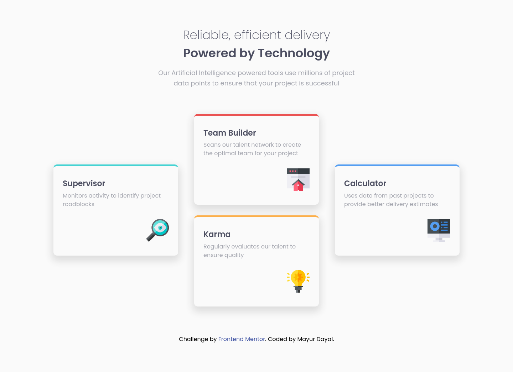

# Frontend Mentor - Four card feature section

This is a solution to the [Four card feature section challenge on Frontend Mentor](https://www.frontendmentor.io/challenges/four-card-feature-section-weK1eFYK). Frontend Mentor challenges help you improve your coding skills by building realistic projects.

## The challenge

The challenge is to build out this feature section and get it looking as close to the design as possible.

The users should:

- View the optimal layout for the site depending on their device's screen size

**To do this challenge, you need a basic understanding of HTML and CSS.**

## Screenshots

### Mobile Screenshot ( >= 375px )

 

### Desktop Screenshot ( >= 1024px)

### Links

- Solution URL: [mayurDayal2000/four-card-feature-section-main](https://github.com/mayurDayal2000/four-card-feature-section-main)
- Live Site URL: [/four-card-feature-section-main](https://mayurdayal2000.github.io/four-card-feature-section-main)

### Built with

- Semantic HTML5 markup
- CSS custom properties
- CSS Grid and Transition

### Author

- Frontend Mentor - [@mayurDayal2000](https://www.frontendmentor.io/profile/mayurDayal2000)
